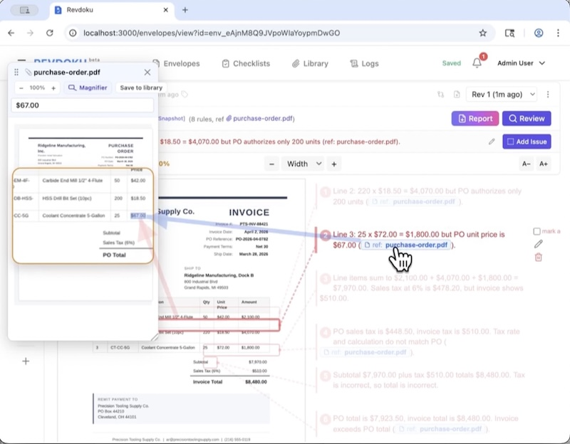

<p align="center">
  
</p>

<h1 align="center">Revdoku</h1>

<p align="center">
  <strong>Revdoku is an open-source AI-powered platform for reviewing important documents.</strong>
</p>

<p align="center">
  <a href="https://revdoku.com"></a>
  <a href="LICENSE"></a>
  
  
</p>

<p align="center">
 Revdoku is an open-source AI-powered platform for reviewing important documents. It automates line-by-line checks against the rules your team defines, compares data to your reference values, runs custom scripts, and highlights mismatches for review.
</p>

## Demo video

<p align="center">
  <a href="revdoku-demo.mp4">
    
  </a>
</p>

<p align="center">
  <video controls width="720" poster="revdoku-demo-poster.jpg">
    <source src="revdoku-demo.webm" type="video/webm" />
  </video>
</p>

## Features

- **Pinpoint review against your checklists.** Each rule lands a highlight on the exact line, number, or clause it flags.
- **Cross-document checks.** Attach a quote, an amendment, or a policy and the AI checks across them.
- **Revision-aware.** Upload a new version; Revdoku tracks what changed and what you've already reviewed.
- **No issue forgotten.** Past failed checks carry forward to the next revision automatically.
- **Add Manual Issues and Per Document Rules** add per document (envelope) rules and checks (re-checked in new revisions automatically).
- **Security** Documents and sensitive data are encrypted with 256-bit AES.  
- **Shareable reports.** Export PDF or HTML with every finding rendered inline, or create public share links for frozen report snapshots.
- **Custom Scripts.** Run custom scripts over found values for additional analysis like counting, sum by categories and more. 
- **Cloud or Local LLM** Connects to cloud AI or local LLM for full privacy. 
- **Upload via Email** Send documents to special per-account email address and documetns are automatically uploaded to your account.

### Sharing reports

Core includes public `/shared/<token>` report links out of the box. Set `SHARE_REPORT_ENABLED=false` to disable sharing instance-wide. Without `AWS_S3_SHARED_BUCKET`, self-hosted installs store shared snapshots on local disk under `storage/shared_reports/`.

Hosted version is available at [www.revdoku.com](https://www.revdoku.com/).

---

## See it in action

Drop a document, run a checklist, read the report. 

<details>
<summary><strong>▶ Watch all demo walkthroughs</strong> &nbsp;<sub>(click to expand)</sub></summary>

<br/>

#### Invoices

| Demo | What it shows |
|---|---|
| [](https://www.youtube.com/watch?v=co3R2eEmhJA)<br/>**Invoice review** | Drop an invoice in, run the Invoice Review checklist with Google Gemini, and read the issues and passes the AI surfaces. |
| [](https://www.youtube.com/watch?v=7WGU6Ef5m1U)<br/>**Invoice vs. legal services agreement — track revisions** | Paste the agreement, generate a compliance checklist, run review on the invoice, then upload a corrected revision and confirm all checks pass. |
| [](https://www.youtube.com/watch?v=QSTj3pnXtaI)<br/>**Detect changes between document revisions** | Upload v1 of an invoice, run review, then upload v2 and let Revdoku surface every field-level change — terms, amounts, dates, and account numbers. |
| [](https://www.youtube.com/watch?v=8Ux-Z5SGgmY)<br/>**Categorize an expense report** | ADVANCED. Tag every line item with the Expense Categorization checklist, then use a custom script to produce a per-category spending breakdown. |

#### Legal & contracts

| Demo | What it shows |
|---|---|
| [](https://www.youtube.com/watch?v=SvUzAIfdSp4)<br/>**Mutual NDA review** | Upload a mutual NDA, attach the NDA & Confidentiality Agreement Review checklist, run review with Google Gemini, and read the resulting issues and report. |
| [](https://www.youtube.com/watch?v=9DbJ0t_Lg2g)<br/>**Residential lease review** | Attach the Lease Agreement Review checklist, run review, and read page-1 / page-2 issues plus the final report. |
| [](https://www.youtube.com/watch?v=VFKfILOda7o)<br/>**Master Services Agreement — clause compliance** | Audit an MSA against a required-clause checklist; missing clauses are flagged with their location in the document. |
| [](https://www.youtube.com/watch?v=gIq8JtWWpZA)<br/>**Software License — extract defined terms** | Pull every defined term from a Software License and Services Agreement so Section 1 can be audited at a glance. |
| [](https://www.youtube.com/watch?v=GmsGw7WhyQs)<br/>**Joint Venture Agreement — party reference count** | Count every reference to each party in a multi-page JV agreement, mapping every mention back to its spot in the PDF. |


#### Healthcare

| Demo | What it shows |
|---|---|
| [](https://www.youtube.com/watch?v=N6rogvDbBRU)<br/>**Tally ICD-10 diagnosis codes** | Pull every ICD-10 diagnosis code out of a clinical note and tally how many times each one appears. |
| [](https://www.youtube.com/watch?v=fgBmvDd15-c)<br/>**Count medications by drug class** | Tally medications on a patient record by drug class, surfacing interaction flags from the clinic's pharmacy note. |
| [](https://www.youtube.com/watch?v=Rnvn3U7JQhQ)<br/>**Extract vital signs** | Extract triage and post-treatment vital signs from a clinical note, flagging abnormal readings and tying each value back to its source row. |

#### Marketing & Content

| Demo | What it shows |
|---|---|
| [](https://www.youtube.com/watch?v=S7EWSALI6j0)<br/>**Check an ad against brand guidelines** | Paste your brand guide to generate a compliance checklist, run review on the ad, then upload a revised version and let Revdoku re-check the prior issues automatically. |
| [](https://www.youtube.com/watch?v=CkKd9a-Mudk)<br/>**Detect AI writing in a blog post** | Run a one-line prompt to generate a 6-rule AI-writing-detection checklist, then review the blog post for repetitive structures, shallow content, and factual inaccuracies. |
| [](https://www.youtube.com/watch?v=VSPAzC3YRMY)<br/>**Resume review** | Run the Resume & CV Review checklist on a resume PDF and read the issues the AI finds — missing contact fields, inconsistent date formats, and more. |
| [](https://www.youtube.com/watch?v=S7EWSALI6j0)<br/>**Check an ad against brand guidelines** | Paste your brand guide to generate a compliance checklist, run review on the ad, then upload a revised version and let Revdoku re-check the prior issues automatically. |
| [](https://www.youtube.com/watch?v=fXzRPfyqjvU)<br/>**Investor letter — Warren Buffett-style checklist** | Generate a value-investing checklist from a single-line Buffett prompt, run it against Nebius Group's Q4 2025 letter to shareholders, and read the per-rule pass/fail report. |

#### Photo inspection

| Demo | What it shows |
|---|---|
| [](https://www.youtube.com/watch?v=GJI20s2kt6Q)<br/>**Extract data from a hand-drawn chart** | Upload a chart image, run an AI checklist to read every data point, then use a built-in script to deduplicate and list the extracted values. |
| [](https://www.youtube.com/watch?v=EUjTsmmNvgI)<br/>**Count wires and insulators on utility poles** | Count energized conductors and insulators on each of four utility-pole inspection photos, producing per-pole totals with highlighted regions. |


</details>

Full playlist on YouTube → <https://www.youtube.com/playlist?list=PLoSGpfRUg7ywQ7kbEiCuXNI5nN-CRxbZe>

---

## Quick start

Choose the path that matches how you want to run Revdoku.

### Cloud hosted

Use this if you want Revdoku without installing Docker, running a server, or
managing backups.

Sign up at [app.revdoku.com](https://app.revdoku.com/).

### Local install (for a single user)

This is the recommended path for local laptop/computer use. It creates a local Revdoku
data folder, generates the required secrets once, starts the Docker app, and
keeps your data on your computer.

**You'll need**
- [Docker Desktop](https://www.docker.com/products/docker-desktop/) running.
- On Windows, use [WSL](https://learn.microsoft.com/en-us/windows/wsl/install) for this command.

Open Terminal on macOS/Linux, or WSL on Windows, then run:

```bash
curl -fsSL https://raw.githubusercontent.com/revdoku/revdoku/main/install-local.sh | sh
```

When it finishes, open <http://localhost:3000>. The first account you create
becomes the local admin.

The installer creates `~/.revdoku` with:

- `revdoku.env` - generated local secrets, including the key required to read encrypted local data.
- `compose.yml` - Docker Compose configuration.
- `storage/` - SQLite databases and uploaded files.
- `revdoku` - helper command for start, stop, update, logs, status, open, and backup.

Keep this folder together. To move Revdoku to a new computer or make a backup,
run:

```bash
~/.revdoku/revdoku backup
```

Do not copy only `storage/`. The `revdoku.env` file contains the key needed to
read your local documents and saved provider keys.

Native Windows PowerShell install is experimental:

```powershell
Invoke-WebRequest -UseBasicParsing https://raw.githubusercontent.com/revdoku/revdoku/main/install-local.ps1 -OutFile "$env:TEMP\revdoku-install-local.ps1"; powershell -ExecutionPolicy Bypass -File "$env:TEMP\revdoku-install-local.ps1"
```

### Self-host on a server

Use this path for a private team server, VPS, homelab, or internal network
install. This uses the prebuilt Docker image, but you own the domain, HTTPS,
configuration, updates, and backups.

**You'll need**
- A Linux server with Docker Engine and the Docker Compose plugin.
- A domain or internal hostname that points to the server.
- A TLS proxy such as Caddy, nginx, Traefik, or Cloudflare Tunnel.

1. **Clone and configure Revdoku:**

   ```bash
   git clone https://github.com/revdoku/revdoku.git
   cd revdoku
   cp env.example .env.local
   ```

2. **Edit `.env.local`:**

   Fill in every `[REQUIRED]` value. At minimum, generate the four secrets,
   set the first admin email/password, and set the public URL:

   ```bash
   APP_HOST=revdoku.yourdomain.com
   APP_PROTOCOL=https
   ```

   If HTTPS terminates at your proxy, also set:

   ```bash
   REVDOKU_FORCE_SSL=true
   ```

3. **Start Revdoku:**

   ```bash
   ./bin/start -d
   ```

4. **Point your HTTPS proxy at Revdoku:**

   Forward external HTTPS traffic to `http://127.0.0.1:3000` on the server.

Before inviting other users:

- Back up `.env.local` and the Docker volume `revdoku_storage` together.
- Do not run `docker compose down -v` unless you intentionally want to delete local data.
- Decide whether public signups should stay enabled. For a private server, set `REVDOKU_REGISTRATION_ENABLED=false` after creating the first admin user.
- Configure SMTP in `.env.local` if you need email confirmation, password resets, or invitations.
- Configure AI provider keys inside the app under **Account -> AI -> Providers**, or set operator-wide keys in `.env.local`.

### Manual install from source (for advanced users)

Use this path if you want to clone the repository, edit configuration manually,
or rebuild the image locally for development.

**You'll need**
- [Docker Desktop](https://www.docker.com/products/docker-desktop/) (or Docker Engine on Linux)
- [Git](https://git-scm.com/downloads)
- If you are on Windows: [WSL for Windows](https://learn.microsoft.com/en-us/windows/wsl/install)

1. **Open a terminal.**
   
   - macOS → Terminal app
   - Windows → Start menu → "WSL" (install with `wsl --install` in PowerShell if you haven't)
   - Linux → any terminal

2. **Clone and enter the repo:**

   ```bash
   git clone https://github.com/revdoku/revdoku.git
   cd revdoku
   ```

3. **Create your config file:**

   You will need to copy sample config file ([env.example](https://github.com/revdoku/revdoku/blob/main/env.example)) and set your own values.

   First, copy sample config into a new file `.env.local`
   
   ```bash
   cp env.example .env.local
   ```  

   Note: the filename starts with a dot that makes it hidden in some file managers. Use `ls -la` in the terminal, or enable **Show hidden files** in your file browser to see it. 

4. **Open `.env.local`** in any plain-text editor (VS Code, Cursor, TextEdit, Notepad) and fill in every line marked `[REQUIRED]`. 

Step-by-step instructions are inside the file, including the `openssl` commands that generate the four random secrets.

In most cases you can edit file using the command `code .env.local` and it will open this file in you favorite code editor.

Note: if you type `code .` and press Enter it will open the whole folder for editing and you will be able to edit any file in that folder.

5. **Start it:**

   ```bash
   ./bin/start
   ```

   This will:
   - check if config file is available and set up 
   - check if it can download pre-built latest docker image from Github (from `ghcr.io/revdoku/revdoku:latest`). May take few minutes, be patient.
   - if not, it will rebuild the docker image. May take few minutes, be patient.

6. Finally open <http://localhost:3000> and sign in with the admin login and password, the same that you've set to `REVDOKU_BOOTSTRAP_ADMIN_EMAIL` and `REVDOKU_BOOTSTRAP_ADMIN_PASSWORD` in `.env.local` on **Step 4**.

7. To connect to AI, set up API keys for your favorite **AI providers** in **inside the app** in **Account → AI → Providers**. Supported providers:

   - Open AI <openai.com>
   - Google Cloud <cloud.google.com>
   - OpenRouter <openrouter.ai>. **IMPORTANT**: DO enable zero-data retention (ZDR) in <https://openrouter.ai/settings/privacy> and disable training to avoid your documents and files being captured by AI providers)
   - Local LLM (LM Studio, Ollama and others)
   - Custom LLM providers

   When Revdoku runs in Docker and the LLM runs on the same computer, use
   `host.docker.internal` instead of `localhost` in the provider URL. Examples:
   LM Studio `http://host.docker.internal:1234/v1`, Ollama
   `http://host.docker.internal:11434/v1`.

Note for power users: to rebuild from source instead of pulling the prebuilt docker image use: 

```
./bin/start --build
```

---

## Configuration

All configuration is environment variables. 

See [env.example](https://github.com/revdoku/revdoku/blob/main/env.example) for the complete list with inline docs

---

## Security

- All uploaded files and sensitive data fields in the database are encrypted at rest with AES-256-GCM encryption using `LOCKBOX_MASTER_KEY` defined in `.env.local` or the local installer `revdoku.env`. SQLite uses WAL mode.
- Users may setup 2-factor authentication for signing in.
- Logs are created and available in /logs
- No telemetry.

For enhanced security, HIPAA (BAA) please consider hosted version at [www.revdoku.com](https://revdoku.com)

Report issues privately: **[security@revdoku.com](mailto:security@revdoku.com)** 
**please**, don't open a public GitHub issue.

---

## Contributing

Bug reports and PRs welcome! For larger changes, open a GitHub Discussion first so we can align on scope.

---

## License

Revdoku is open source, licensed under the GNU Affero General Public
License v3 (AGPLv3) — see [LICENSE](./LICENSE). A commercial license
is also available; contact sales@revdoku.com.

---

Hosted version: <https://revdoku.com> · Issues & bugs: <https://github.com/revdoku/revdoku/issues>
